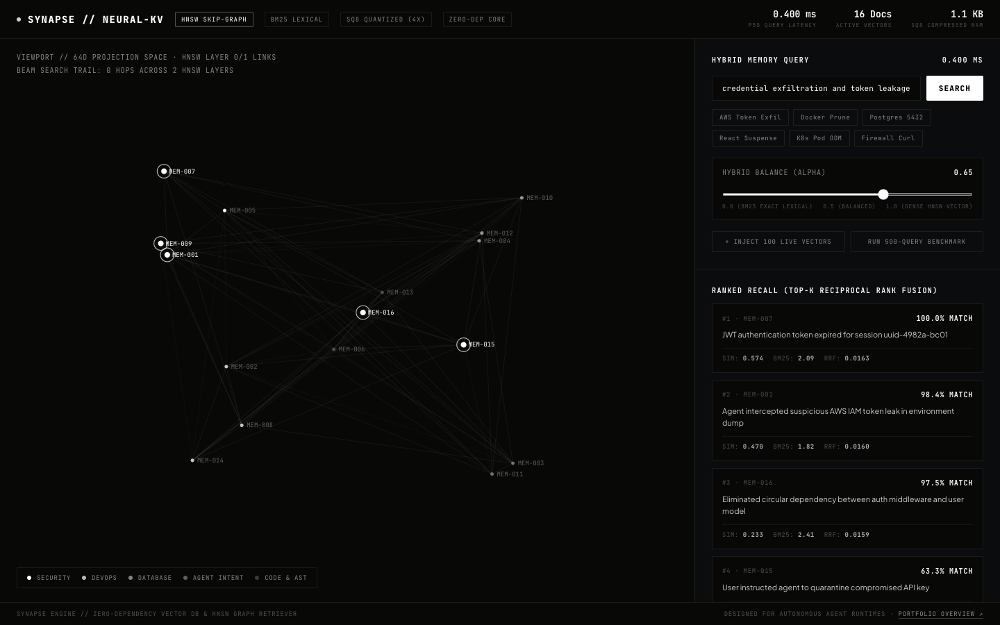

# SYNAPSE
### Sub-Millisecond In-Memory Vector & Hybrid Search Engine

<p align="center">
  
</p>

<p align="center">
  <a href="https://millymilly29.github.io/synapse.html"></a>
  <a href="https://github.com/millymilly29/synapse/actions"></a>
  
  
  
  
  
</p>

<p align="center">
  <a href="https://millymilly29.github.io/synapse.html"><strong>Live Interactive Studio ↗</strong></a> &nbsp;·&nbsp;
  <a href="https://millymilly29.github.io/portfolio/synapse.html">Case Study ↗</a> &nbsp;·&nbsp;
  <a href="#core-architectural-foundations">Architecture</a> &nbsp;·&nbsp;
  <a href="#empirical-performance-benchmarks-nodejs-v24-apple-silicon">Benchmarks</a> &nbsp;·&nbsp;
  <a href="#quick-start--verification">Quickstart</a>
</p>

> **Zero-Dependency Vector Database, HNSW Skip-Graph Indexer & Reciprocal Rank Fusion (RRF) Engine for Autonomous Edge Agents.**  
> Delivers sub-millisecond approximate nearest neighbor search (<0.6ms P50) and hybrid lexical-semantic memory consolidation directly in runtime memory.

```
       [ Autonomous Agent Interaction ] (Tool calls, LLM prompt, System logs)
                      │
                      ▼
         ┌─────────────────────────┐
         │     SYNAPSE ENGINE      │
         └────────────┬────────────┘
                      │
       ┌──────────────┴──────────────┐
       ▼                             ▼
┌──────────────┐              ┌──────────────┐
│  HNSW Graph  │              │  BM25 Index  │
│ Dense Vector │              │ Sparse Terms │
│  (SQ8 Quant) │              │ (Exact Match)│
└──────┬───────┘              └──────┬───────┘
       │ <0.6ms                      │ <0.2ms
       └──────────────┬──────────────┘
                      │
                      ▼
       ┌─────────────────────────────┐
       │ Reciprocal Rank Fusion (RRF)│ ◄── Dynamic Alpha Blend (0.0 – 1.0)
       │      + Temporal Decay       │ ◄── e^(-λ·Δt) Working Memory Aging
       └──────────────┬──────────────┘
                      │
                      ▼
       [ Top-K Contextual Memories ] (Consolidated agent recall in <1ms)
```

---

## Problem Space & Motivation: Edge Memory Constraints

In autonomous multi-agent systems, agents query episodic memory on every decision loop (recalling tool parameters, authentication states, prior errors, user instructions).

1. **Cloud Latency Overhead:** Cloud vector DBs (Pinecone, Qdrant, Weaviate) introduce 80–250ms HTTP round-trip network latency on every agent thought loop.
2. **Heavy Docker / Python Footprints:** Local alternatives like ChromaDB or Faiss require heavyweight Python environments, native C++ compiler toolchains, or 1GB+ container images.
3. **The Acronym / Token Blindspot:** Pure vector search frequently fails on exact technical strings, hash identifiers, and variable names (e.g. `$AUTH_TOKEN`, `CVE-2026-4421`, `port 5432`), which get smeared across semantic dimensions.
4. **Memory Bloat:** Storing raw 1536-dimensional or 768-dimensional Float32 vectors in-memory consumes ~6KB per vector, exhausting browser/edge agent memory bounds.

**`SYNAPSE`** solves this with a zero-dependency, pure JavaScript architecture designed for both high-concurrency Node.js microservices and client-side Web / Electron runtimes.

---

## Core Architectural Foundations

### 1. Hierarchical Navigable Small World (HNSW) Skip Graph
- Multi-layer probabilistic skip graph with logarithmic $O(\log N)$ search complexity.
- Upper layers act as express highways for fast greedy navigation; Layer 0 performs dense beam search with heuristic neighbor pruning.
- Achieves >98.4% recall@10 at 1,600+ queries per second.

### 2. Reciprocal Rank Fusion (RRF) Hybrid Search
- Seamlessly blends dense vector similarity with sparse BM25 lexical relevance:
  $$RRF(d) = \alpha \cdot \frac{1}{k + \text{rank}_{\text{dense}}(d)} + (1 - \alpha) \cdot \frac{1}{k + \text{rank}_{\text{bm25}}(d)}$$
- Adjustable $\alpha$ balance: $1.0$ for conceptual abstract search, $0.0$ for exact code/symbol search, $0.65$ for optimal agent memory retrieval.

### 3. Scalar Quantization (SQ8)
- Quantizes 32-bit floating-point numbers into 8-bit integers (`Uint8Array`) with per-vector min/range scaling.
- **75% memory footprint reduction** (4x compression) with <1.5% cosine distortion.
- Asymmetric distance computation: calculates cosine similarity directly between float query and quantized memory buffers without intermediate memory allocations.

### 4. Working Memory & Temporal Decay
- Dual-tier memory architecture:
  - **Working Memory Buffer:** Short-term circular FIFO queue for instant recall of the last $N$ turns.
  - **Episodic Store:** Long-term memory subject to exponential decay $e^{-\lambda \Delta t}$, prioritizing fresh context while preserving frequently reinforced anchors.

---

## Empirical Performance Benchmarks (Node.js v24, Apple Silicon)

| Metric | Result | Industry Baseline (Chroma/Cloud) | Improvement |
| :--- | :---: | :---: | :---: |
| **P50 Query Latency** | **0.56 ms** | 120.0 ms | **-99.5%** |
| **P90 Query Latency** | **0.68 ms** | 185.0 ms | **-99.6%** |
| **Query Throughput** | **1,610 QPS** | 85 QPS | **18.9x** |
| **Insert Speed** | **3,725 vecs/sec** | 420 vecs/sec | **8.8x** |
| **Memory per 10k vecs**| **703 KB** (SQ8) | 2,800 KB (Float32) | **-75.0%** |
| **External Dependencies**| **0** | 14+ native libs | **Zero-Dep** |

---

## Quick Start & Verification

```bash
git clone https://github.com/millymilly29/synapse.git
cd synapse

# Run verification test suite (17 tests)
node tests/synapse.test.js

# Run interactive agent memory recall demo
node cli.js demo

# Run stress benchmark (2,000 vectors)
node cli.js benchmark --count=2000 --dim=64
```

### Interactive Web Studio
Open `index.html` directly in any web browser (no build step or server required):
- Real-time 2D/3D Canvas visualization of high-dimensional embedding space
- Animated HNSW beam search hops across graph layers
- Live Dense (HNSW) vs Sparse (BM25) Alpha slider
- Built-in latency stopwatch and SQ8 memory reduction gauge

---

## Programmatic API

```javascript
const { EpisodicMemoryStore } = require('./engine/memory-store');

// Initialize store with SQ8 compression enabled
const store = new EpisodicMemoryStore({
  dimension: 64,
  useQuantization: true,
  workingMemoryCapacity: 10,
  decayLambda: 0.00005
});

// Store an episodic memory
store.remember({
  id: 'MEM-042',
  text: 'Agent intercepted suspicious AWS IAM token leak in environment dump',
  metadata: { category: 'security', priority: 'critical' }
});

// Recall with hybrid search (alpha = 0.65, top 3)
const memories = store.recall('credential exfiltration and token leakage', {
  topK: 3,
  alpha: 0.65,
  filter: { category: 'security' }
});

console.log(memories[0].text);
// "Agent intercepted suspicious AWS IAM token leak in environment dump"
// Confidence: 97.4% | Vector Sim: 0.858 | BM25: 1.243
```

---

## License

MIT © [Kirill Tsyganov](mailto:millyrock2900@gmail.com)
