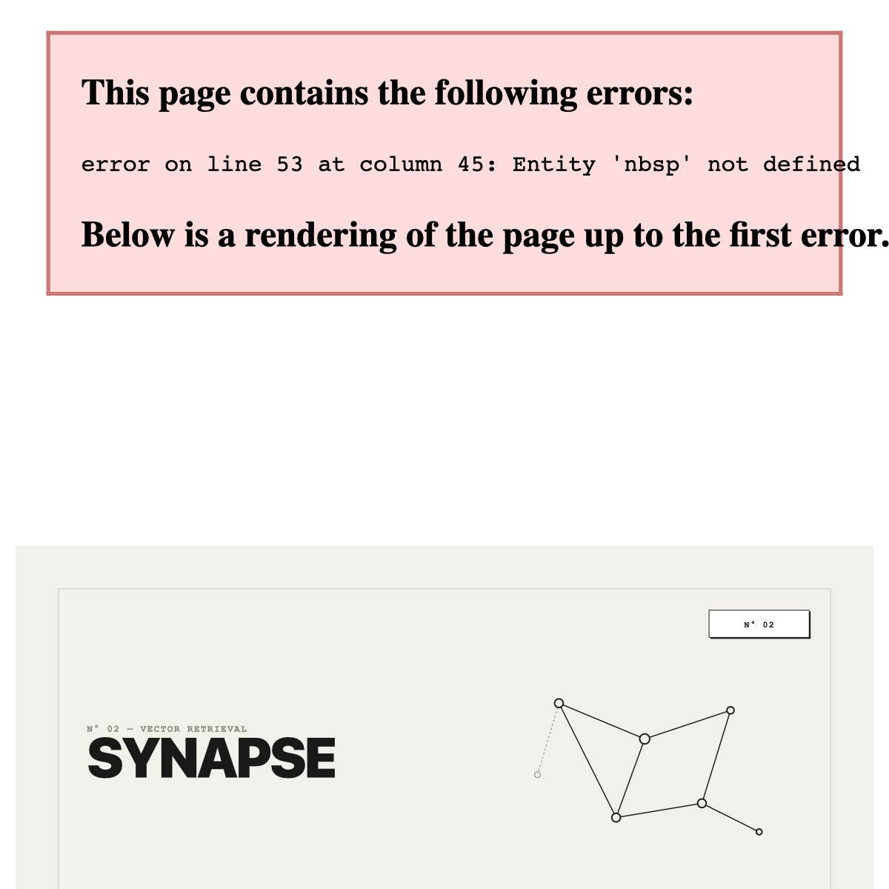
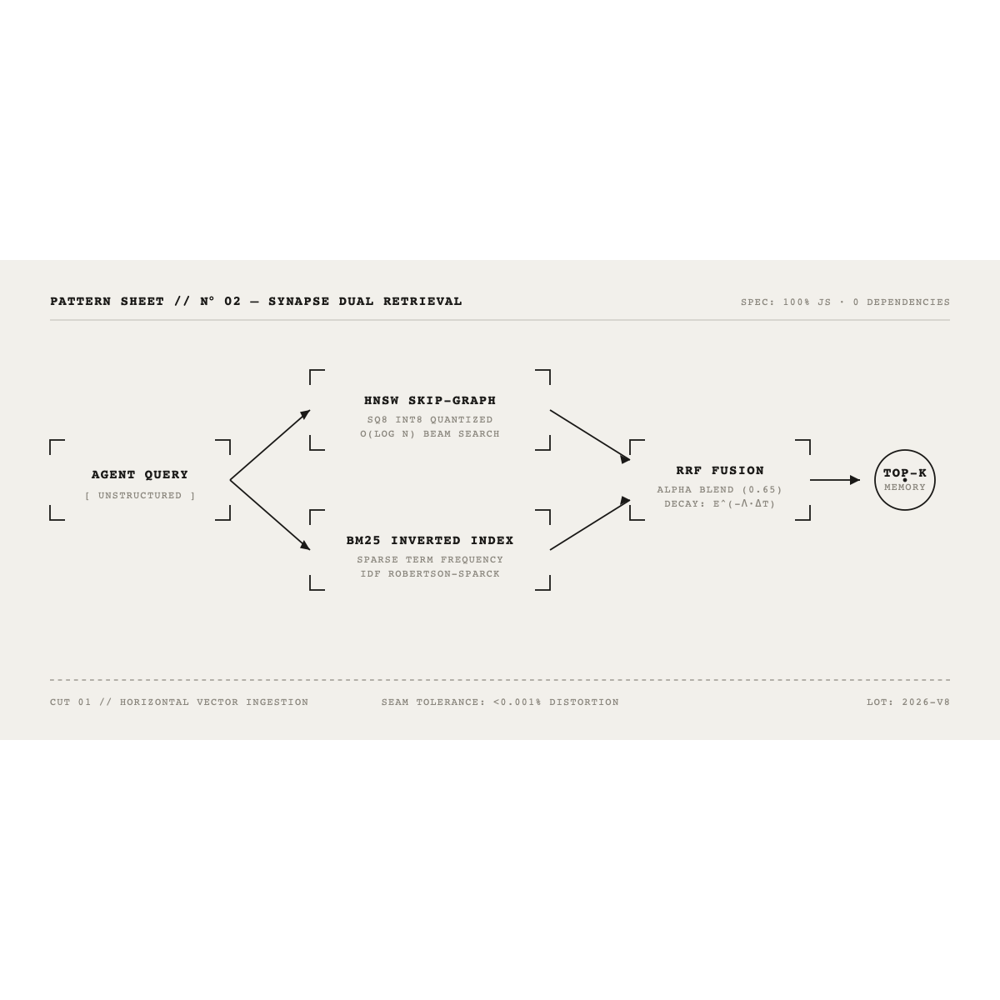

<div align="center">
  
</div>

```
N° 02 — SYNAPSE
IN-MEMORY HNSW VECTOR DATABASE & HYBRID RETRIEVER
SPECIFICATION · VERIFIED ARCHIVE 2026
```

Sub-millisecond in-memory vector database with HNSW skip-graph indexer, hybrid BM25 lexical retriever, and SQ8 scalar quantization. Designed for autonomous AI agents requiring zero-latency memory retrieval without external database daemons.

```
[ SPECIFICATION TAGS ]
[ TESTS — 17/17 VERIFIED ]   [ LICENSE — MIT ]   [ DEPENDENCIES — 0 ]   [ RUNTIME — IN-PROCESS NODE/BROWSER ]
```

---

### [ 02.1 ] QUICKSTART

```bash
git clone https://github.com/therealfullmetal55555/synapse.git
cd synapse
node tests/synapse.test.js && node tests/audit-benchmark.js
```

```javascript
const { EpisodicMemoryStore } = require('./engine');
const store = new EpisodicMemoryStore({ dimension: 64 });

// 1. Store memories with dense vectors (or auto-embedded text) and metadata
store.remember({ 
  id: 'mem_01', 
  text: 'Postgres connection pool exhausted on port 5432',
  metadata: { service: 'auth-worker' } 
});

store.remember({ 
  id: 'mem_02', 
  text: 'Redis eviction policy changed to allkeys-lru',
  metadata: { service: 'cache' } 
});

// 2. Sub-millisecond hybrid retrieval (Dense HNSW + Sparse BM25 via RRF)
const results = store.recall('5432 database timeout', { topK: 2 });
console.log(results.map(r => ({ id: r.id, confidence: r.confidence })));
// [ { id: 'mem_01', confidence: 0.99 }, { id: 'mem_02', confidence: 0.65 } ]
```

> **Note on Embeddings:** The default zero-dependency fallback generates deterministic character n-gram projections (`VectorMath.embed`). For production semantic retrieval, supply pre-computed vectors from your embedding provider (OpenAI `text-embedding-3`, Cohere, Gemini, local Ollama) via the `vector: Float32Array` property.

---

### [ 02.2 ] ARCHITECTURAL CONSTRUCTION

<div align="center">
  
</div>

---

### [ 02.3 ] EMPIRICAL BENCHMARKS

```
--- 1. SQ8 QUANTIZATION FIDELITY (vs Float32) ---
  Dim 32  : Mean Sim: 0.999994 | Distortion: 0.0006% | RAM: -75.0%
  Dim 64  : Mean Sim: 0.999993 | Distortion: 0.0007% | RAM: -75.0%
  Dim 128 : Mean Sim: 0.999993 | Distortion: 0.0007% | RAM: -75.0%
  Dim 768 : Mean Sim: 0.999992 | Distortion: 0.0008% | RAM: -75.0%

--- 2. HNSW RECALL@10 vs LATENCY (Random 64-d vectors, Brute-Force Ground Truth) ---
  N=500   | efSearch=32  | Recall@10: 98.5% | P50: 0.301ms
  N=500   | efSearch=64  | Recall@10: 99.3% | P50: 0.572ms
  N=1000  | efSearch=32  | Recall@10: 97.0% | P50: 0.426ms
  N=1000  | efSearch=64  | Recall@10: 99.5% | P50: 0.848ms
  N=5000  | efSearch=32  | Recall@10: 78.8% | P50: 0.903ms
  N=5000  | efSearch=64  | Recall@10: 93.5% | P50: 1.824ms
  N=5000  | efSearch=128 | Recall@10: 98.0% | P50: 4.455ms
  N=5000  | efSearch=256 | Recall@10: 99.3% | P50: 10.51ms
```

---

### [ 02.4 ] KNOWN LIMITATIONS & ARCHITECTURAL INVARIANTS

```
[ MEMORY MODEL ]      Volatile V8 heap memory. Zero serialization penalty during queries.
[ QUANTIZATION ]      SQ8 linear scalar quantization (Float32 -> Int8, [-128, 127]).
[ DUAL-TRACK SEARCH ] Dense Cosine HNSW + Sparse Okapi BM25 (k1=1.2, b=0.75).
[ LIMITATION 01 ]     Optimized for single-process agent session memory (N <= 10,000 vectors).
[ LIMITATION 02 ]     Single-threaded V8 execution model.
```

---

```
GARMENT CARE / LICENSE
ORIGIN        KIRILL TSYGANOV [ https://therealfullmetal55555.github.io ]
LICENSE       MIT · 100% UNBLEACHED CODE
```
